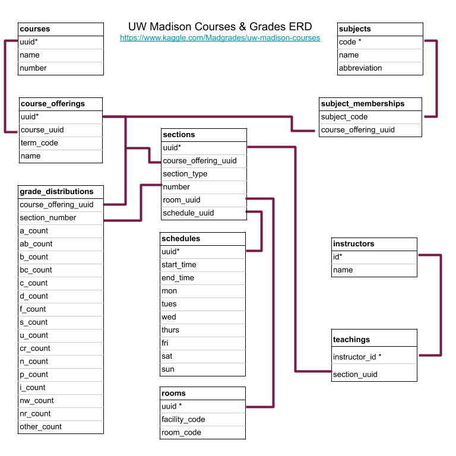

# uw_madison_courses_grades
Hypothesis testing with UW Madison grades. Project formed from https://www.kaggle.com/Madgrades/uw-madison-courses

In order to access this data, please make a Kaggle account at the link above and download the zip file.

This project assumes that the user will fork and clone this project locally and that the data will be downloaded into a data subfolder in the project directory.

First run the bash script, then run the sql scripts in the following order to generate the 
data used in our hypothesis tests

