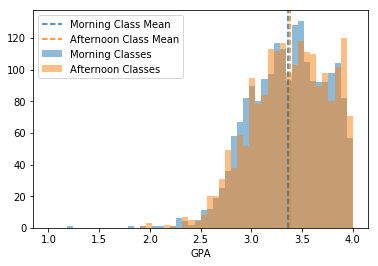

# Comparing Morning and Afternoon GPAs at UW Madison since 2006

This notebook performs a SQL query on the UW Madison database and does a hypothesis test comparing morning and afternoon class GPAs.

$H_0$ = There is no difference between GPAs of morning and afternoon classes.

$H_A$ = There is a difference between GPAs of morning and afternoon classes.

---

## Import necessary Python libraries and modules


```python
from sqlalchemy import create_engine
from scipy import stats
import pandas as pd
import matplotlib.pyplot as plt
import numpy as np
import seaborn as sns
```

## Query the database and create dataframes of morning and afternoon classes


```python
engine = create_engine('postgresql:///uw_madison')
```


```python
morning_df = pd.read_sql('SELECT * FROM morning_classes_gpas;', engine)
morning_df.describe()
```


<div>
<style scoped>
    .dataframe tbody tr th:only-of-type {
        vertical-align: middle;
    }

    .dataframe tbody tr th {
        vertical-align: top;
    }

    .dataframe thead th {
        text-align: right;
    }
</style>
<table border="1" class="dataframe">
  <thead>
    <tr style="text-align: right;">
      <th></th>
      <th>section_number</th>
      <th>section_gpa</th>
    </tr>
  </thead>
  <tbody>
    <tr>
      <th>count</th>
      <td>123451.000000</td>
      <td>123451.000000</td>
    </tr>
    <tr>
      <th>mean</th>
      <td>7.673555</td>
      <td>3.373092</td>
    </tr>
    <tr>
      <th>std</th>
      <td>13.850752</td>
      <td>0.366443</td>
    </tr>
    <tr>
      <th>min</th>
      <td>1.000000</td>
      <td>0.000000</td>
    </tr>
    <tr>
      <th>25%</th>
      <td>1.000000</td>
      <td>3.117647</td>
    </tr>
    <tr>
      <th>50%</th>
      <td>2.000000</td>
      <td>3.395833</td>
    </tr>
    <tr>
      <th>75%</th>
      <td>8.000000</td>
      <td>3.666667</td>
    </tr>
    <tr>
      <th>max</th>
      <td>234.000000</td>
      <td>3.996503</td>
    </tr>
  </tbody>
</table>
</div>


```python
afternoon_df = pd.read_sql('SELECT * FROM afternoon_classes_gpas;', engine)
afternoon_df.describe()
```


<div>
<style scoped>
    .dataframe tbody tr th:only-of-type {
        vertical-align: middle;
    }

    .dataframe tbody tr th {
        vertical-align: top;
    }

    .dataframe thead th {
        text-align: right;
    }
</style>
<table border="1" class="dataframe">
  <thead>
    <tr style="text-align: right;">
      <th></th>
      <th>section_number</th>
      <th>section_gpa</th>
    </tr>
  </thead>
  <tbody>
    <tr>
      <th>count</th>
      <td>166296.000000</td>
      <td>166296.000000</td>
    </tr>
    <tr>
      <th>mean</th>
      <td>7.026675</td>
      <td>3.389228</td>
    </tr>
    <tr>
      <th>std</th>
      <td>11.750693</td>
      <td>0.371208</td>
    </tr>
    <tr>
      <th>min</th>
      <td>1.000000</td>
      <td>0.000000</td>
    </tr>
    <tr>
      <th>25%</th>
      <td>1.000000</td>
      <td>3.121739</td>
    </tr>
    <tr>
      <th>50%</th>
      <td>2.000000</td>
      <td>3.416667</td>
    </tr>
    <tr>
      <th>75%</th>
      <td>8.000000</td>
      <td>3.695652</td>
    </tr>
    <tr>
      <th>max</th>
      <td>211.000000</td>
      <td>3.998418</td>
    </tr>
  </tbody>
</table>
</div>


## Remove the classes where the average GPA was 4.0 and only look at GPAs


```python
morning_minus_four_os = morning_df.loc[morning_df['section_gpa'] != 4.0]['section_gpa']
morning_minus_four_os.describe()
```


    count    123451.000000
    mean          3.373092
    std           0.366443
    min           0.000000
    25%           3.117647
    50%           3.395833
    75%           3.666667
    max           3.996503
    Name: section_gpa, dtype: float64


```python
afternoon_minus_four_os = afternoon_df.loc[afternoon_df['section_gpa'] != 4.0]['section_gpa']
afternoon_minus_four_os.describe()
```


    count    166296.000000
    mean          3.389228
    std           0.371208
    min           0.000000
    25%           3.121739
    50%           3.416667
    75%           3.695652
    max           3.998418
    Name: section_gpa, dtype: float64


## Choose 2,000 random classes from each population to do the hypothesis testing on


```python
morning_choice = np.random.choice(morning_minus_four_os, size=2000, replace=False)
afternoon_choice = np.random.choice(afternoon_minus_four_os, size=2000, replace=False)
```

## Generate histogram plots for GPAs


```python
fig, ax = plt.subplots()
ax.hist(morning_choice, alpha=0.5, color='#1f77b4', bins=50, range=(1.0, 4.0), label='Morning Classes')
ax.axvline(morning_choice.mean(), alpha=1, color='#1f77b4', linestyle='dashed', label='Morning Class Mean')
ax.hist(afternoon_choice, alpha=0.5, bins=50, color='#ff7f0e', range=(1.0, 4.0), label='Afternoon Classes')
ax.axvline(afternoon_choice.mean(), alpha=1, color='#ff7f0e', linestyle='dashed', label='Afternoon Class Mean')
ax.legend()
ax.set_xlabel('GPA');
```





## Perform statistical testing for the hypothesis


```python
stats.ttest_ind(morning_choice, afternoon_choice, equal_var=False)
```


    Ttest_indResult(statistic=-1.5768663072428946, pvalue=0.1149054103240241)


This shows that there is not a statistically significant difference between the morning and afternoon class GPAs.

Thus, we fail to reject the null hypothesis that grades are the same between the morning and afternoon.
