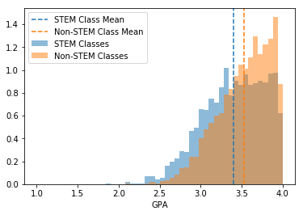

# Comparing STEM and non-STEM GPAs at UW Madison since 2006

This notebook performs a SQL query on the UW Madison database and does a hypothesis test comparing STEM and non-STEM classes. STEM classes are defined by which subjects have their books in the Teaching and Learning Research Guide for STEM and SBE libraries: https://researchguides.library.wisc.edu/teaching_learning

$H_0$ = There is no difference between GPAs of STEM and non-STEM classes

$H_A$ = There is a difference between the GPAs of STEM and non-STEM classes

---

## Import necessary Python libraries and modules


```python
from sqlalchemy import create_engine
from scipy import stats
import pandas as pd
import matplotlib.pyplot as plt
import numpy as np
import seaborn as sns
```

## Query the database and create dataframes of STEM and non-STEM classes


```python
engine = create_engine('postgresql:///uw_madison')
```


```python
stem_query = """SELECT * FROM stem_classes;"""
```


```python
stem_df = pd.read_sql(stem_query, engine)
stem_df.describe()
```


<div>
<style scoped>
    .dataframe tbody tr th:only-of-type {
        vertical-align: middle;
    }

    .dataframe tbody tr th {
        vertical-align: top;
    }

    .dataframe thead th {
        text-align: right;
    }
</style>
<table border="1" class="dataframe">
  <thead>
    <tr style="text-align: right;">
      <th></th>
      <th>section_number</th>
      <th>section_gpa</th>
    </tr>
  </thead>
  <tbody>
    <tr>
      <th>count</th>
      <td>29263.000000</td>
      <td>29263.000000</td>
    </tr>
    <tr>
      <th>mean</th>
      <td>3.876260</td>
      <td>3.385967</td>
    </tr>
    <tr>
      <th>std</th>
      <td>10.121531</td>
      <td>0.379954</td>
    </tr>
    <tr>
      <th>min</th>
      <td>1.000000</td>
      <td>0.000000</td>
    </tr>
    <tr>
      <th>25%</th>
      <td>1.000000</td>
      <td>3.117647</td>
    </tr>
    <tr>
      <th>50%</th>
      <td>1.000000</td>
      <td>3.416667</td>
    </tr>
    <tr>
      <th>75%</th>
      <td>2.000000</td>
      <td>3.700000</td>
    </tr>
    <tr>
      <th>max</th>
      <td>296.000000</td>
      <td>3.996622</td>
    </tr>
  </tbody>
</table>
</div>


```python
non_stem_query = """SELECT * FROM non_stem_classes;"""
```


```python
non_stem_df = pd.read_sql(non_stem_query, engine)
non_stem_df.describe()
```


<div>
<style scoped>
    .dataframe tbody tr th:only-of-type {
        vertical-align: middle;
    }

    .dataframe tbody tr th {
        vertical-align: top;
    }

    .dataframe thead th {
        text-align: right;
    }
</style>
<table border="1" class="dataframe">
  <thead>
    <tr style="text-align: right;">
      <th></th>
      <th>section_number</th>
      <th>section_gpa</th>
    </tr>
  </thead>
  <tbody>
    <tr>
      <th>count</th>
      <td>57333.000000</td>
      <td>57333.000000</td>
    </tr>
    <tr>
      <th>mean</th>
      <td>5.135350</td>
      <td>3.517342</td>
    </tr>
    <tr>
      <th>std</th>
      <td>12.715356</td>
      <td>0.325315</td>
    </tr>
    <tr>
      <th>min</th>
      <td>1.000000</td>
      <td>0.000000</td>
    </tr>
    <tr>
      <th>25%</th>
      <td>1.000000</td>
      <td>3.300000</td>
    </tr>
    <tr>
      <th>50%</th>
      <td>1.000000</td>
      <td>3.562500</td>
    </tr>
    <tr>
      <th>75%</th>
      <td>3.000000</td>
      <td>3.789474</td>
    </tr>
    <tr>
      <th>max</th>
      <td>271.000000</td>
      <td>3.998418</td>
    </tr>
  </tbody>
</table>
</div>


## Remove the classes where the average GPA is 4.0


```python
stem_df = stem_df.loc[stem_df['section_gpa'] != 4.0]['section_gpa']
stem_df.describe()
```


    count    29263.000000
    mean         3.385967
    std          0.379954
    min          0.000000
    25%          3.117647
    50%          3.416667
    75%          3.700000
    max          3.996622
    Name: section_gpa, dtype: float64


```python
non_stem_df = non_stem_df.loc[non_stem_df['section_gpa'] != 4.0]['section_gpa']
non_stem_df.describe()
```


    count    57333.000000
    mean         3.517342
    std          0.325315
    min          0.000000
    25%          3.300000
    50%          3.562500
    75%          3.789474
    max          3.998418
    Name: section_gpa, dtype: float64


## Choose 2,000 random classes from each population to do hypothesis testing on


```python
stem_choice = np.random.choice(stem_df, size=2000, replace=False)
non_stem_choice = np.random.choice(non_stem_df, size=2000, replace=False)
```

## Generate histogram plots for GPAs


```python
fig, ax = plt.subplots()
ax.hist(stem_choice, density=True, color='#1f77b4', alpha=0.5, bins=50, range=(1.0, 4.0), label='STEM Classes')
ax.axvline(stem_choice.mean(), color='#1f77b4', alpha=1, linestyle='dashed',label='STEM Class Mean')
ax.hist(non_stem_choice, density=True, color='#ff7f0e', alpha=0.5, bins=50, range=(1.0, 4.0), label='Non-STEM Classes')
ax.axvline(non_stem_choice.mean(), color='#ff7f0e', alpha=1, linestyle='dashed', label='Non-STEM Class Mean')
ax.legend()
ax.set_xlabel('GPA');
```





## Perform statistical testing for the hypothesis


```python
stats.ttest_ind(stem_choice, non_stem_choice, equal_var=False)
```


    Ttest_indResult(statistic=-11.595118593138709, pvalue=1.377867556258258e-30)


The T-statistic and shapes of the histograms show that the GPAs for STEM and non-STEM classes are different and the p-value shows that the differences are significant.

As such, we reject the null hypothesis.
